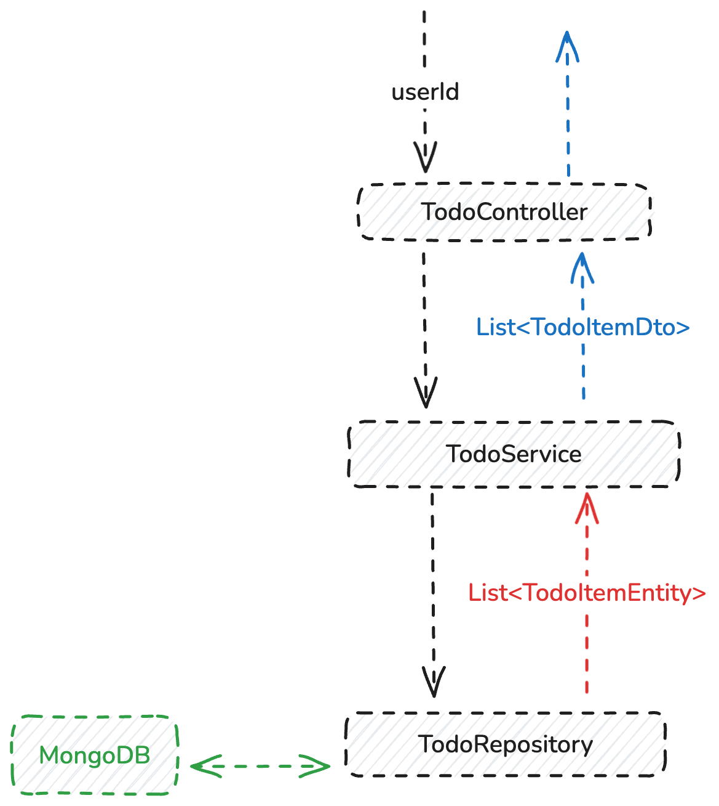

# Todo Service

#### Built with:
- A local MongoDB server
- A local Spring Boot server with Java 21
- Docker & Docker Compose
#### Table of content:
- API Specification
- How to Run Unit Test
- How to Test API with real Database
- Project Structure for the Main Codebase

## API Specification

A user can have multiple TODO lists.
This API allows you to fetch a user's top 10 most urgent tasks across all their lists, regardless of which specific list the task belongs to, as long as the user owns the task.

Note: In a real-world application, features such as login, JWT authentication, and authorization would be implemented. However, since these features are not mentioned in the task requirements, we will exclude them to reduce the scope of the task.
#### Requst

> GET /api/users/{userId}/top-across-all-lists

where `userId` is the UUID for the user

#### Response

> Array ( TodoitemDto )

where TodoItemDto is defined as:

| Field	| Type | Description                             |
| --- |-------------------|-----------------------------------------|
| id |	String | 	A UUID of the todo item |
| name |	String | 	Name of the todo item.                 |
| description |	String | 	Description of the todo item           |
| score	| Float	| A higher value indicates a higher priority |


## 2 How to run Unit Test

#### Step 1: Build and run the docker

```
docker compose -f dev.docker-compose.yml up --build
```

#### Step 2: Run The Unit Test Script
```
docker exec -it todoapp-dev mvn test
```

#### Step 3: Wait patiently

Result for unit testing:
```
[INFO] Tests run: 1, Failures: 0, Errors: 0, Skipped: 0, 
Time elapsed: 31.10 s -- in com.raymondpang365.todo.TodoServiceTest
```

## 3 How to test API with real Database

#### Step 1: Build and run the docker

(You can skip this if you have already run the containers)
```
docker compose -f dev.docker-compose.yml up --build
```

#### Step 2: Seed the Database

```
docker exec -it mongodb-dev bash -c "sh /docker-entrypoint-initdb.d/init-mongo.sh"
```
This runs the seeding script in `seeder/seed.js`, populating the DB with 30 simulated TODO data.

#### Step 3: Call the API directly:

This call fetches the top 10 Todos of user id `63fdfc8c4b3b1f12a2c3d8ab`.

```
curl -H "Accept: application/json" "http://localhost:8080/api/users/63fdfc8c4b3b1f12a2c3d8ab/top-across-all-lists"
```

which should outputs an array of 10 results


## 4 Project Structure for the Main Codebase

The main code base is in `src/main/java/com/raymondpang365/todo`




### TodoServiceTest

Path: [src/test/java/com/raymondpang365/todo/TodoServiceTest.java](src/test/java/com/raymondpang365/todo/TodoServiceTest.java)


This Unit Test is only used for testing the TodoService, which retrieves and sorts TODO lists
This Unit Test is not responsible for testing the MongoDB query
This Unit Test mocks the ORM layer `MongoRepository` with mock data,
so it does not depend on real MongoDB connection.

### TodoItemEntity

Path: [src/main/java/com/raymondpang365/todo/TodoItemEntity.java](src/main/java/com/raymondpang365/todo/TodoItemEntity.java)

Defines the full data model in MongoDB `todo` collection

- Use Float instead of Integer for `score` field to achieve O(1) time complexity by a midpoint value
  in case user wants to insert an item with a priority score relative to two adjacent items

- Greater `score` value indicates higher priority

### TodoItemDto

Path: [src/main/java/com/raymondpang365/todo/TodoItemDto.java](src/main/java/com/raymondpang365/todo/TodoItemDto.java)

Defines the data model in the API, which includes only includes id, name, description, and score.
DTO stands for `Data Transfer Object`

This is the format of the TODO item that will be used in the API response


### TodoController

Path: [src/main/java/com/raymondpang365/todo/TodoController.java](src/main/java/com/raymondpang365/todo/TodoController.java)

Defines the API endpoint

### TodoService

Path: [src/main/java/com/raymondpang365/todo/TodoService.java](src/main/java/com/raymondpang365/todo/TodoService.java)

Defines the logic to sort the items and get the highest 10 priority


### TodoRepository

Path: [src/main/java/com/raymondpang365/todo/TodoRepository.java](src/main/java/com/raymondpang365/todo/TodoRepository.java)

Defines the DB query.

- Q1: Why is there only 1 DB call for a distributed DB? 
  - We do not need to iterate over each DB instance manually;
  MongoDB cluster handles that automatically behind one DB call.

- Q2: Why is there no raw query statement visible in the code?

  - Spring Data Mongo is an ORM that automatically generates the query based on the method name.

